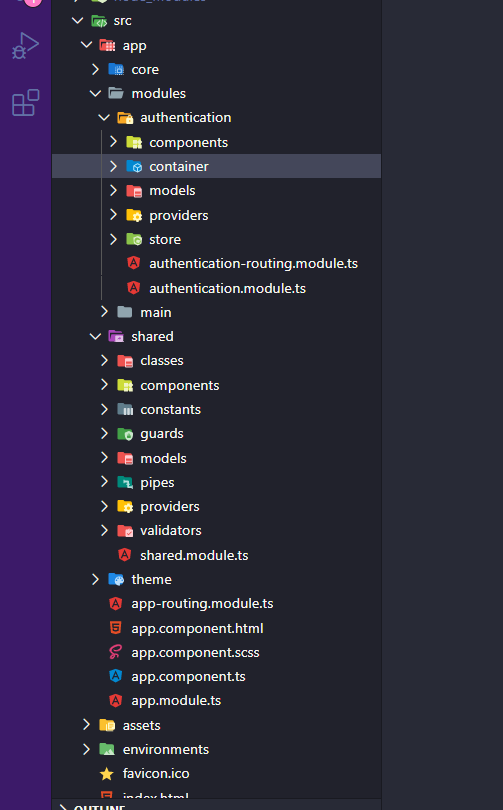

# GempeExplanation FRONTEND 🤯

Repositório para organizar a resolução de problemas recorrentes e padrões utilizados no **frontend**. 🚀

## Problemas

## Padrões

**Arquitetura** de um projeto em **Angular**

### Estrutura inicial
- core/
	- core.module.ts
		- Deve ser importado apenas no app.module.ts
		- Módulo para inicializar todos os imports globais necessários, Ex
			- Libs para gerenciamento de estado
			- Módulo Http
	- providers/
		- Pasta com os services globais EX
			- service para autenticação 
- module/
	- Todos os módulos da aplicação
	- Os módulos contem components, container, providers, models, validators, etc...
	- Os containers são os componentes que se comunicam com as rotas
		- Sempre que possível, busque os dados internos dentro dos containers, e passe-os via @Input para os components.
	- Os components são subcomponentes que estão presente nos containers
- shared/
	- Módulo para compartilhar components, models, providers, guards, pipes, validators, etc...
	- Esse módulo deve ser importado dentro de cada "feature" módulo (módulo  dentro da pasta module)
	- shared.module.ts
		- exporte tudo o que os otros módulos vão precisar, EX:
			- ReactiveFormModule, RouterModule, components, providers, etc...
		- não importar esse módulo no app.module.ts
- theme/
	- variables.scss
		- Caso esteja utilizando scss, utilize esse arquivo para armazenar as variáveis de estulo

